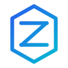

<div align="center">



# ZyRealm · 自由界

**Adaptive LLM Routing Gateway**

A provider control plane for resilient multi-model, multi-credential LLM traffic.

[简体中文](README_zh.md) · [Getting Started](USAGE.md) · [Releases](https://github.com/mumu-140/ZyRealm/releases)

</div>

> **Origin and attribution**
>
> ZyRealm is based on [bestruirui/octopus](https://github.com/bestruirui/octopus) and continues to use its AGPL-3.0 licensed foundation. This repository has evolved substantially in relay routing, provider recovery, credential scheduling, protocol compatibility, observability and operations. Upstream attribution and the original license are intentionally preserved.

## What is ZyRealm?

ZyRealm (自由界) is an adaptive LLM gateway designed to keep client-facing protocols stable while dynamically choosing safe upstream paths. It aggregates providers and credentials behind unified OpenAI/Anthropic-compatible endpoints, then applies runtime eligibility, failure classification, cooldown, replay safety and fair credential scheduling before each wire attempt.

The routing pipeline is conceptually:

```text
Request
  ↓
Provider candidates
  ↓
Credential eligibility
  ↓
Capability eligibility
  ↓
Runtime recovery / cooldown
  ↓
Fair scheduling
  ↓
RoutingDecision
  ↓
Upstream wire attempt
```

## Why this fork exists

Octopus provides the original aggregation, protocol conversion and management foundation. ZyRealm keeps that base, while focusing on failure-aware routing for real multi-provider production traffic.

Major extensions include:

- **Adaptive failure routing** — semantic failure classification, provider/model cooldowns and bounded failover.
- **Replay safety** — distinguishes requests that were not sent from requests whose upstream execution outcome is unknown.
- **Credential fairness** — provider-local fair scheduling for multiple credentials without using accounting cost as a scheduler.
- **Capability negative cache** — temporarily avoids provider/model/protocol combinations known to reject a request shape.
- **Retry-After recovery** — honors upstream recovery hints with bounded local waiting.
- **Anthropic compatibility hardening** — malformed HTTP 200 responses and narrow payload-schema incompatibilities can fail over instead of becoming false successes.
- **Attempt tracing** — each real wire attempt records a routing decision and failure classification.
- **Configurable request budget** — up to 20 wire attempts per client request, with a separate provider budget and unknown-outcome replay guard.
- **Site and channel management** — provider/channel resources, synchronized aggregator sites, models, groups and pricing.
- **OpenAI Chat / Responses / Images and Anthropic relay support**.

## UI

The ZyRealm management panel is organized as a control plane rather than a generic admin dashboard:

- persistent desktop routing sidebar;
- responsive mobile navigation;
- provider/channel/group/model management;
- runtime reliability settings;
- request and cost analytics;
- dark/light themes;
- user and API-key authentication modes.

## Quick start

### Docker / GHCR

Use an immutable release tag rather than `latest`:

```bash
docker pull ghcr.io/mumu-140/octopus-concurrency:v0.11.0-mumu.2
```

The GitHub repository is **`mumu-140/ZyRealm`**. The GHCR image namespace intentionally remains **`ghcr.io/mumu-140/octopus-concurrency`** for deployment compatibility with existing servers and Compose files.

A minimal local configuration listens on port `8080` and stores SQLite data under `data/`.

```json
{
  "server": {
    "host": "0.0.0.0",
    "port": 8080
  },
  "database": {
    "type": "sqlite",
    "path": "data/data.db"
  },
  "log": {
    "level": "info"
  }
}
```

Default credentials on a fresh installation are `admin` / `admin`. Change them immediately after first login.

### Local development

```bash
cd web
pnpm install --frozen-lockfile
NEXT_PUBLIC_API_BASE_URL="http://127.0.0.1:8080" pnpm run dev

# another terminal, repository root
go run . start
```

## Client protocols

ZyRealm can expose unified model groups to clients using:

- OpenAI Chat Completions;
- OpenAI Responses;
- OpenAI Images;
- Anthropic Messages;
- WebSocket relay paths used by supported tool workflows.

The gateway can perform protocol conversion where supported and can route around provider-specific capability failures without changing the client model name.

## Routing safety model

Three limits are deliberately separate:

1. **Provider budget** limits how many distinct providers a single client request can enter.
2. **Wire-attempt budget** limits real upstream sends and is configurable up to 20.
3. **Unknown-outcome replay budget** remains tightly bounded to reduce duplicate execution and duplicate billing risk.

Local skips such as disabled channels, runtime cooldown, concurrency saturation or circuit rejection do not consume a wire attempt because no upstream request was sent.

## Compatibility naming

Some internal names still contain `octopus` by design:

- Go module/import paths inherited from upstream;
- `OCTOPUS_*` environment variables;
- database/migration compatibility names;
- the established GHCR image namespace used by existing deployments;
- historical protocol examples and migration records where changing the identifier would break compatibility.

These are compatibility surfaces, not the current product identity. The UI and public product name are **ZyRealm / 自由界**.

## License and upstream

ZyRealm is distributed under **GNU AGPL-3.0**, following the license of the Octopus codebase it is based on. See [LICENSE](LICENSE).

Original project: [bestruirui/octopus](https://github.com/bestruirui/octopus)

This project does not claim authorship of upstream Octopus code. Fork-specific changes and subsequent development are maintained in this repository.
